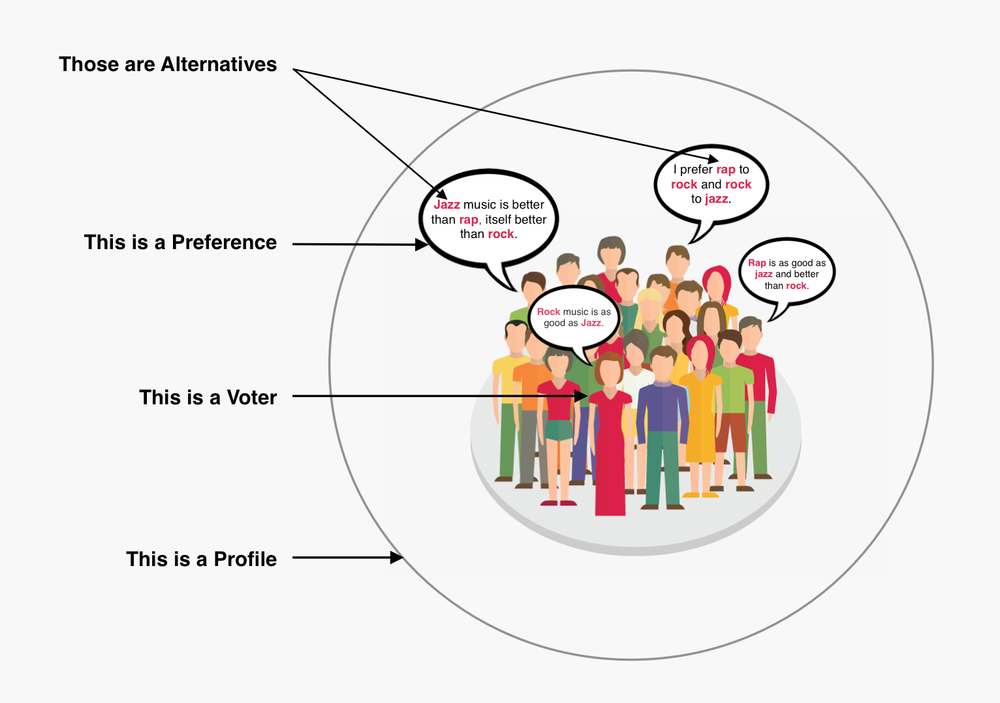

= Welcome in the J-Voting Documentation 

== J-Voting basic vocabulary

- *An alternative* is a possible choice among a set.
- *A preference* is a ranking of alternatives.
- *A voter* is someone who emitted a preference. 
- *A profile* gathers all the voters linked to their preference. 

=== Example of a simple J-Voting scenario 

==== Now there are many different types of preferences or profiles in J-Voting.

== *Summary of J-Voting documentation:*

=== Titre 1
==== link:chapters/preferenceInterfaces.adoc[1.1 The notion of Preferences]
==== link:chapters/profileInterfaces.adoc[1.2 The notion of Profile]

=== Titre 2
==== link:chapters/profileInterfaces.adoc[2.1 The notion of Profile]
==== link:chapters/profileInterfaces.adoc[2.2 The notion of Profile]
