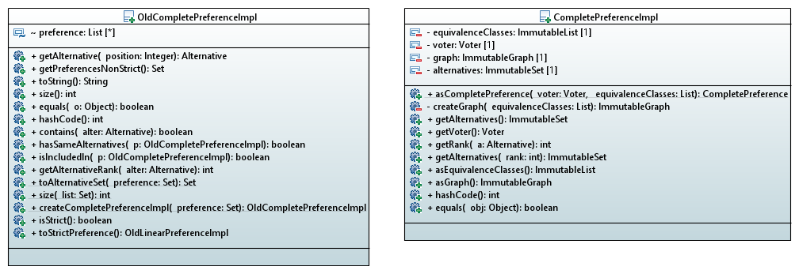

= 1.3 Transition from Old to new CompletePreferenceImpl Class

====== link:../README.adoc[Summary]

=== Both initial Class Diagrams

To better see the difference between the two classes, please find below a comparative table of their respective methods.

[cols="1,1,2", options="header"] 
|===
|Equivalent method in OldCompletePreferenceImpl
|Equivalent method in CompletePreferenceImpl
|Contract

|getPreferencesNonStrict()
|asEquivalenceClasses()
|Returns the preference attribute of the class (a List<Set<Alternative>>).

|getAlternative(Integer position)
|getAlternatives(int rank)
|Returns the alternative at the given rank.

|size(List<Set<Alternative>> list)
|/
|Returns the number of alternatives in the preference.

|contains(Alternative alter)
|/
|Says whether an alternative is the preference.

|hasSameAlternatives(OldCompletePreferenceImpl p)
|/
|Says whether two preferences have the same alternatives (not in the same order).

|isIncludedIn(OldCompletePreferenceImpl p)
|/
|Says whether the preference is included in given one ( if it contains all alternatives of the given preference).

|getAlternativeRank(Alternative alter)
|getRank(Alternative a)
|Returns the rank of a given alternative.

|toAlternativeSet(List<Set<Alternative>> preference)
|toALternativeSet(ImmuatbleList<ImmutableSet<Alternative>> preference)
|Returns a alternatives Set with all the alternatives in the List of Sets.

|isStrict()
|/
|Says whether the preference is strict (no exæquo).

|toStrictPreference()
|/
|If the preference is strict, returns the LinearPreference created from the complete one.

|/
|getVoter()
|Returns the voter associated to this preference.

|/
|createGraph(List<? extends Set<Alternative>> equivalenceClasses)
|Create the graph associated to the preference (each node is an alternative and an edge from node a to node b means a>=b).

|/
|asGraph()
|Returns the graph associated to the preference. 

|===

