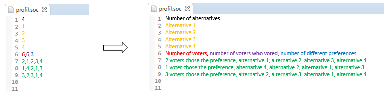

= 2.2 GUI Input Files 

====== link:../README.adoc[Summary]

== SOC file

Currently, the application only allows us to use .soc files as input.
A .soc file represents a strict complete profile _(for more information see link:../GUI.adoc[2.1])_.

If you want to create your own one, you have to imagine a profile and to follow some writing rules.
Here is an example of a .soc file and its meaning.

Some other formats exist but will deal with them later *as below*

== Differents formats for _voting data_

=== RanksFormat 

This format allows non strict preference. The rank of each alternative in the preference is filled in for every voter.

Example Ranks format :
link:../../src/test/resources/io/github/oliviercailloux/j_voting/profiles/management/rank_format.ods[rank_format.ods]

Example Rank format reduced : 
link:../../src/test/resources/io/github/oliviercailloux/j_voting/profiles/management/rank_format_reduced.ods[rank_format_reduced.ods]

.Example of Rank format
[options="header"]
|==============
||1|2|3|4|5|6
|1|1|1|5|5|4|1
|2|3|1|4|4|4|1
|3|2|2|2|2|1|1
|4|3|4|3|3|3|2
|5|4|3|1|1|2|3
|==============

.Meaning of Rank format
[options="header"]
|============================
||Voter 1|Voter 2|Voter 3|Voter 4|Voter 5|Voter 6
|Alternative 1|Alternative 1 is the preferred alternative of Voter 1(1st rank)|1|5|5|4|Voter 6 chose alternative 1 in 1st rank (ex-aequo with alternatives 2 & 3)
|Alternative 2|3|1|Voter 3 chose alternative 2 in 4th rank|4|4|1
|Alternative 3|2|2|2|2|1|1
|Alternative 4|3|4|3|3|3|2
|Alternative 5|4|3|1|1|2|3
|============================

=== VotersToRankings 

This format allows only strict preference. The preference for each voter is filled in.

Example VotersToRankings format : 
link:../../src/test/resources/io/github/oliviercailloux/j_voting/profiles/management/profile_format_strict.ods[profile_format_strict.ods]

Example VotersToRankings format reduced : 
link:../../src/test/resources/io/github/oliviercailloux/j_voting/profiles/management/profile_format_strict_reduced.ods[profile_format_strict_reduced.ods]

.Example of Profile format
[options="header"]
|==============
|1|2|3|4|5|6
|1|2|4|5|2|1
|3|5|2|1|3|4
|2|1|3|2|4|5
|4|2|5|3|5|2
|5|3|1|4|1|3
|==============

.Meaning of Profile format
[options="header"]
|==============
|Voter 1|Voter 2|Voter 3|Voter 4|Voter 5|Voter 6
|Alternative 1|2|4|Alternative 5|2|1
|Alternative 3|5|2|Alternative 1|3|4
|Alternative 2|1|3|Alternative 2|4|5
|Alternative 4|2|5|Alternative 3|5|2
|Alternative 5|3|1|Alternative 4|1|3
|==============

=== CountOfRankings

This format is very useful to represent a lot of data.
This format can be improved by removing the 5 first lines.

Example CountOfRankings format : 
link:../../src/test/resources/io/github/oliviercailloux/j_voting/profiles/management/election_data_format.ods[election_data_format.ods]

.Example of Election data format
|=========
|3|||
|1|||
|2|||
|3|||
|664|664|6|
|263|2|1|3
|249|1|2|3
|78|1|3|2
|46|2|3|1
|17|3|1|2
|11|3|2|1
|=========

.Meaning of Election data format
|=========
|3 alternatives|||
|Alternative 1|||
|Alternative 2|||
|Alternative 3|||
|664 voters|664 voters voted|6 differents preferences|
|263 Voters chose this preference :|Alternative 2 is the best|Alternative 1 is the second|Alternative 3 is the worse
|249 Voters chose this preference :|1|2|3
|78 Voters chose this preference :|1|3|2
|46 Voters chose this preference :|2|3|1
|17 Voters chose this preference :|3|1|2
|11 Voters chose this preference :|3|2|1
|=========
