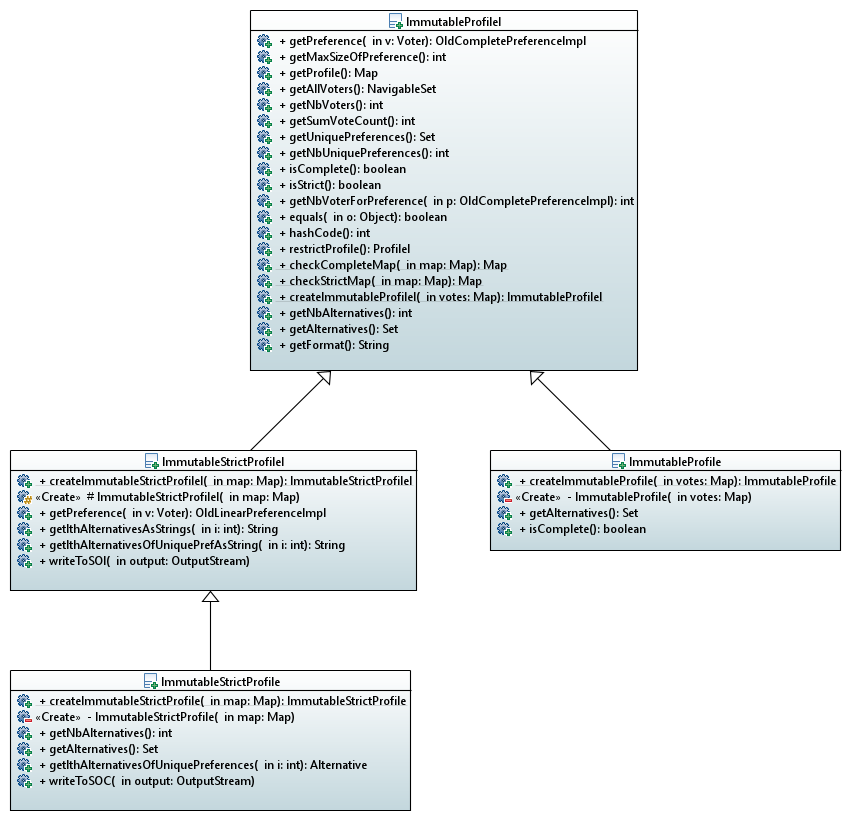
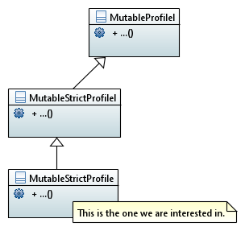

= Annex 2. MutableLinearPreference

====== link:../README.adoc[Summary]

This iteration aims to finalize the Mutable Linear Preference class.

Specifically, we have to modify several files :

== MutableLinearPreferenceImpl.java

The big change is to work from now on with a transitively closed graph.

* LinkedList<Alternative> list become List<Alternative> list

* Delete the constructor and the factory method which takes a Graph in parameter

* Modify swap(Alternative alternative1, Alternative alternative2)

* Modify changeOrder(Alternative alternative1, int rank)

* Modify deleteAlternative(Alternative a) and addAlternative(Alternative a)

* Modify equals() and hashcode() to respect the BP Local design

* Rename deleteAlternative(Alternative a) to removeAlternative(Alternative a)

* Transitively close the graph in the whole class (constructors + methods), and recalculate the closure after each modification

== MutableLinearPreferenceImplTest.java

* Add a test that verifies that the graph returned by asGraph is transitively closed and a test that affects g = pref.asGraph() then modifies pref then verifies that g has changed as it should

* Modify all existing tests using the constructor that takes a list as a parameter

* Test the decorators

== MutableLinearSetDecorator.java

In this class, we have to override methods likely to break the linearity of preference by the set. This class extends ForwardingSet<Alternative> and takes a MutableLinearPreference in parameter.

We will override the following methods :

* public boolean add(Alternative a) 
		
* public boolean addAll(Collection<? extends Alternative> c) 
		
* public boolean remove(Alternative a) 

* public boolean removeAll(Collection<? extends Alternative> c) 
		
* public boolean clear() 
		
* public boolean retainAll(Collection<? extends Alternative> c) 

== MutableLinearGraphDecorator.java

In this class, we have to override methods likely to break the linearity of preference by the graph.This class extends ForwardingGraph<Alternative> and takes a MutableLinearPreference in parameter.

We will override the following methods : 

* public boolean addNode(N node) 
		
* public boolean putEdge(N nodeU, N nodeV) 
		
* public boolean removeEdge(N nodeU, N nodeV) 
		
* public boolean removeNode(N node) 

== MutableStrictProfile.java

Actually, all of the profile are Immutable. With this new class, we need a profile Mutable. The preferences are Strict and complete so it will implement StrictProfile interface. It will be mutable and going to use mutable linear preferences.

Actually, we have 4 Immutable profiles in J-voting :

If we keep the same scheme for the Mutable profiles, then we will need to create three classes as below :

Or do we only create the MutableStrictProfile without the two above ?

But isn't it too much for a single iteration? Wouldn't it be better to save this task for a complete iteration ? Also, do we really need a profile class to build our GUI ?

 
