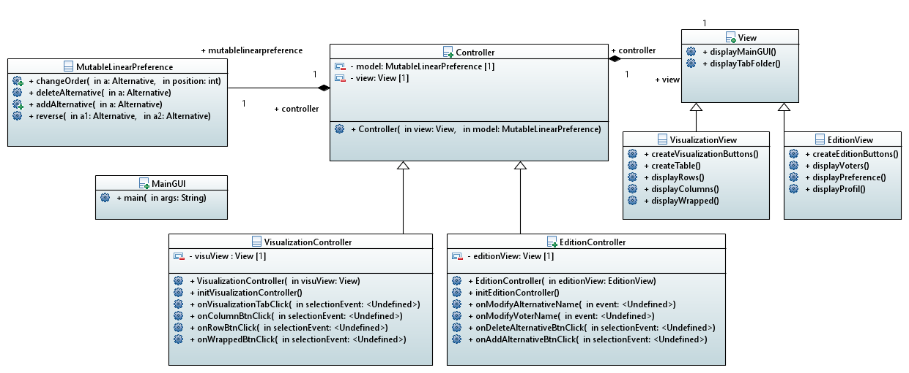

= 2.1 GUI implementation 

====== link:../README.adoc[Summary]

=== GUI Usecase

image:../assets/GUIUseCaseDiagram.png[GUIUseCaseDiagram]

Currently, the GUI enables the user to view a SOC profile (either in rows, columns or wrapped visualization). For the moment the GUI only accepts .soc files already filled.

=== GUI Modeling

image:../assets/GUIMainMenu.png[GUIMainMenu]

We used link:https://wireframesketcher.com/[WireFrame Sketcher]  to design a modeling of our project. You can look at the interactive link:https://github.com/Julienchilhagopian/J-Voting/raw/master/Doc/model/storyboard.pdf[PDF] (download to be able to benefit from the interactions) to better understand our GUI.

The GUI works with a tab system, it is possible to switch from editing to viewing and vice versa for the same file. When you open the application, you will be taken to the profile edition tab. When you click to name the profile, a soc file is created with the current information. It is then possible to modify them by changing the order of the alternatives, adding or deleting alternatives and voters. It is also possible to rename them. 

We can also open an existing file and make the same changes. Each modification is saved in real time on the file. The file is then automatically saved in a defined folder. It is possible to open the view tab to be able to consult a profile.

link:https://en.wikipedia.org/wiki/Nota_bene[NB]: At startup, and as long as the profile name is not filled in, the input boxes are red to indicate that no file is created. When the file name is entered, the file is created and the red disappears from the input boxes.

= MVC pattern applied to J-Voting GUI

We start with an instance of MutableLinearPreference as a model. 

=== *MainGUI*
[cols="1,1", options="header"] 
|===
|Method name
|Explanation 

|Main(String[] args)
| Calls the displayGUI() Method

|displayGUI()
| Creating the main window and calling controllers and views

|centerOnScreen(Display display, Shell shell)
| Center the window in the middle of the screen
|===

=== *Controller*
[cols="1,1", options="header"] 
|===
|Method name
|Explanation 

|controller(MutableLinearPreference startModel)
| Creates the view and the two sub-controllers

|withDefaultModel()
| Creation of the LinearMutablePreference by default when launching the application
|===

=== *EditionController*
[cols="1,1", options="header"] 
|===
|Method name
|Explanation 

|initEditionView()
| Display the default edition view when user enters the gui

|initViewEvents()
| Attach all the controls in the view to its corresponding event callback

|dispatchEvents()
| Allocate controls between different actions 

|onDeleteAlternative(Event e)
| Callback for deleting the delete btn + its associated text field in the edition view

|onAddAlternative(Event e)
| Callback for adding an alternative btn + its associated text field

|getControlsById(String ctrName, Integer id)
| Getter on the edition view in order to find a particular control by its ID

|getControlsByKey(String key)
| Getter on the edition view in order to find a particular control by its key (set in the data object of the control)

|cleanAltContent(Set<Alternative> altList)
| remove of the alternative related control in the view

|===
=== *VisualisationController*
[cols="1,1", options="header"] 
|===
|Method name
|Explanation 

|initVisualisationView()
| Pass the default model to the view for rendering. 

|initVisualisationController()
| We add listeners on all the controls present in the default view when we enter the app. 
We link them to each corresponding callbacks. 

|OnVisualisationTabClick(SelectionEvent event)
| When we enter the visualisation tab we send to the view the current up to date preference model. 

|onColumnBtnClick(SelectionEvent event)
|We call the view function that handle column tab rendering. 
We pass to the view the preference model.

|onRowBtnClick(SelectionEvent event)
|We call the view function that handle row tab rendering. 
We pass to the view the preference model.

|onWrappedBtnClick(SelectionEvent event)
|We call the view function that handle wrapped tab rendering. 
We pass to the view the preference model.

|===

=== *View*
[cols="1,1", options="header"] 
|===
|Method name
|Explanation 

|displayTabFolder()
|This will plug an instance of tabFolder to the mainshell and store it locally. The view decides then to whom the tabfolder is given. 

|buildEditionView()
|This methods returns an instance of EditionView. It builds an EditionView and pass it the tabfolder so that the view can plug itself on it. (This methods has a lot of chances to be called in displayGui() in the main GUI class).

|builVisualizationView()
|This methods returns an instance of Visualization. It builds an Visualization and pass it the tabfolder so that the view can plug itself on it. (This methods has a lot of chances to be called in displayGui() in the main GUI class).

|===

=== *VisualizationView*
[cols="1,1", options="header"] 
|===
|Method name
|Explanation 

|createVisualizationButtons()
|Creation and display buttons for displays in rows, columns and wrapped.

|createTable
|Creates an empty table and fill in it with preferences.

|displayRows
|Rows displaying preference

|displayColumns
|Columns displaying preference

|displayWrapped
|Wrapped displaying preference

|===

=== *EditionView*
[cols="1,1", options="header"] 
|===
|Method name
|Explanation 

|initEditionTab()
| Initialization of the editing tab window

|displayVoters()
| Creation and display the text field with the voter

|displayAlternatives()
|Creates and displays the different text fields corresponding to the voter's alternatives in order of preference. If an alternative is modified then this alternative is modified for each voter.

|displayAddAlternatives(int positionY, int controlId)
| Creation and display of the text field of the alternative to be added. 
Creation and display of the add button.

|getComposite()
|Return the composite of the tab.

|removeControl(Event e)
|Delete window control

|===

