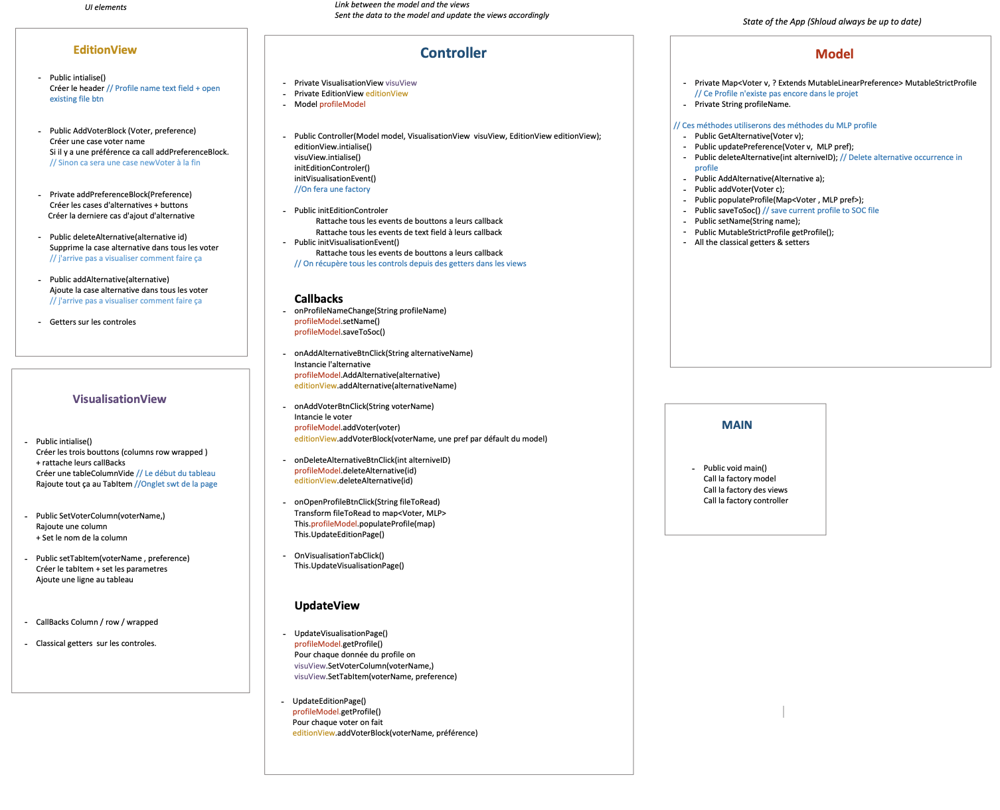

= 2.3 New GUI implementation 

====== link:../README.adoc[Summary]

=== GUI Usage System

image:../assets/GUIUseCaseDiagram.png[GUIUseCaseDiagram]

Currently, the GUI enables the user to view a SOC profile (either in rows, columns or wrapped visualization). For the moment the GUI only accepts .soc files already filled.

We plan to allow the user to create a profile through the graphical user interface. In other words, the user should be able to create a profile file, alternatives, voters and complete preferences. Moreover, the user will be able to modify an existing profile by adding some voters (with their preference) and to reorganize preferences (for a strict profile). Therefore, we plan to implement additional methods in the GUI classes.

=== GUI Modeling

image:../assets/GUIMainMenu.png[GUIMainMenu]

We used link:https://wireframesketcher.com/[WireFrame Sketcher]  to design a modeling of our project. You can look at the interactive link:https://github.com/Julienchilhagopian/J-Voting/raw/master/Doc/model/storyboard.pdf[PDF] (download to be able to benefit from the interactions) to better understand our GUI.

The GUI works with a tab system, it is possible to switch from editing to viewing and vice versa for the same file. When you open the application, you will be taken to the profile edition tab. When you click to name the profile, a soc file is created with the current information. It is then possible to modify them by changing the order of the alternatives, adding or deleting alternatives and voters. It is also possible to rename them. 

We can also open an existing file and make the same changes. Each modification is saved in real time on the file. The file is then automatically saved in a defined folder. It is possible to open the view tab to be able to consult a profile.

link:https://en.wikipedia.org/wiki/Nota_bene[NB]: At startup, and as long as the profile name is not filled in, the input boxes are red to indicate that no file is created. When the file name is entered, the file is created and the red disappears from the input boxes.

== MVC pattern applied to J-Voting GUI
Work in progress

=== Mes questions pour vous/Cailloux

	1) Serait-il mieux de créer une superclass Controller avec le model commun et deux enfants Controllers : un pour la Visualisation et l'autre l'édition ? 
	2) Il me semble plus pertinent de ne pas gérer les callback des events qui ne propagent pas de données dans le controller (exemple : les bouttons collapsable, les btn column row et wrapped dans la visualisation). Veuillez m'indiquer si jamais je me trompe.
	3) Quelle est la meilleur solution pour tenir à jour la page visualisation selon les modifications dans l'onglet d'édition ? (Je propose de supprimer toute la donnée du tableau et de la recréer à partir du profile du model à chaque entrée dans la page. Il y aurait donc un clean du tableau au debut de UpdateVisualisationPage).
4) Plus grande question : comment maintenir coté UI sur la page d'édition cette list de voterBlock (La case voterName + Les préferences). Faut il maintenir une list de composite UI voterBlock dans la view pour aller les chercher quand on doit ajouter une case alternative ou en supprimer une ? 

