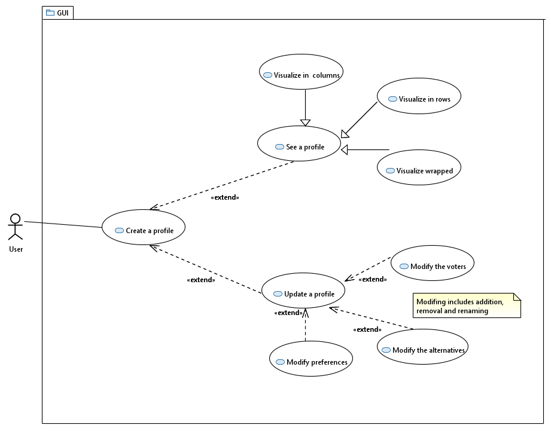
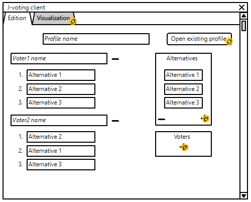

= 2.3 New GUI implementation 

====== link:../README.adoc[Summary]

=== GUI Usage System

Currently, the GUI enables the user to view a SOC profile (either in rows, columns or wrapped visualization). For the moment the GUI only accepts .soc files already filled.

We plan to allow the user to create a profile through the graphical user interface. In other words, the user should be able to create a profile file, alternatives, voters and complete preferences. Moreover, the user will be able to modify an existing profile by adding some voters (with their preference) and to reorganize preferences (for a strict profile). Therefore, we plan to implement additional methods in the GUI classes.

=== GUI Modeling

We used link:https://wireframesketcher.com/[WireFrame Sketcher]  to design a modeling of our project. You can look at the interactive link:https://github.com/Julienchilhagopian/J-Voting/raw/master/Doc/model/storyboard.pdf[PDF] (download to be able to benefit from the interactions) to better understand our GUI.

The GUI works with a tab system, it is possible to switch from editing to viewing and vice versa for the same file. When you open the application, you will be taken to the profile edition tab. When you click to name the profile, a soc file is created with the current information. It is then possible to modify them by changing the order of the alternatives, adding or deleting alternatives and voters. It is also possible to rename them. 

We can also open an existing file and make the same changes. Each modification is saved in real time on the file. The file is then automatically saved in a defined folder. It is possible to open the view tab to be able to consult a profile.

link:https://en.wikipedia.org/wiki/Nota_bene[NB]: At startup, and as long as the profile name is not filled in, the input boxes are red to indicate that no file is created. When the file name is entered, the file is created and the red disappears from the input boxes.

= MVC pattern applied to J-Voting GUI

We assume that we start with an instance of MutableLinearPreference as a model. 

image:../assets/[MVC]

=== *MainGUI*
[cols="1,1", options="header"] 
|===
|Method name
|Explanation 

|Main(String[] args)
| Calls the displayGUI() Method

|displayGUI()
| Instanciates the main shell mechanism. 
*Gathers all the differents MVC pieces* :

- Create MutableLinear Preference Instance 

- Create View instance // and pass it probably the mainshell

- Create Controller and pass it the View & Preference.

- Create Edition & Visualisation child views.

- Create Edition & Visualisation child controllers and pass them the associated child views. 

- Finally calls : 
initEditionView()
initVisualisationView()
initEditionControler()
initVisualisationController()

|===

=== *Controller*
[cols="1,1", options="header"] 
|===
|Method name
|Explanation 

|controller(View v, MutableLinearPreference model)
| Set the parent view and the common model shared by all child controllers

|===

=== *EditionController*
[cols="1,1", options="header"] 
|===
|Method name
|Explanation 

|initEditionView()
| Pass the default preference model to the view for rendering. 

|initEditionControler()
| We add listeners on all the controls present in the default view when we enter the app. 
We link them to each corresponding callbacks. 

|onModifyAlternativeName(Event e)
| We need to find a way to retrieve the name or id of the alternative in modification. 
Then each time that the user type a letter the name of the alternative is changed in the model (A voir)

|onModifyVoterName(Event e)
|Each time that the user type a letter the name of the voter is updated in the model (A voir)

|onDeleteAlternativeBtnClick(SelectionEvent event)
| We retrieve the name or the id of the alternative to be deleted. 
Then we delete the alternative from the preference model. 
- We call a method from the view that delete an Alternative case. 
- Or we send the whole new model to the view and she takes care of rendering all element based on the model. 

|onAddAlternativeBtnClick(SelectionEvent event)
| We add a new alternative to the preference model with as name : the text present in the text field (getter on that text field). Then : 
- We call a method from the view that add a Alternative case. 
- Or we send the whole new model to the view and she takes care of rendering all element based on the model. 

|===

=== *VisualisationController*
[cols="1,1", options="header"] 
|===
|Method name
|Explanation 

|initVisualisationView()
| Pass the default preference model to the view for rendering. 

|initVisualisationController()
| We add listeners on all the controls present in the default view when we enter the app. 
We link them to each corresponding callbacks. 

|OnVisualisationTabClick(SelectionEvent event)
| When we enter the visualisation tab we send to the view the current up to date preference model. 

|onColumnBtnClick(SelectionEvent event)
|We call the view function that handle column tab rendering. 
We pass to the view the preference model

|onRowBtnClick(SelectionEvent event)
|We call the view function that handle row tab rendering. 
We pass to the view the preference model

|onWrappedBtnClick(SelectionEvent event)
|We call the view function that handle wrapped tab rendering. 
We pass to the view the preference model

|===

== Improvements needed linked to MVC implementation

- Currently the Alternative class has no name but solely an ID. 
We need to store a string name inside it with and getter&setters on the attribute. 
