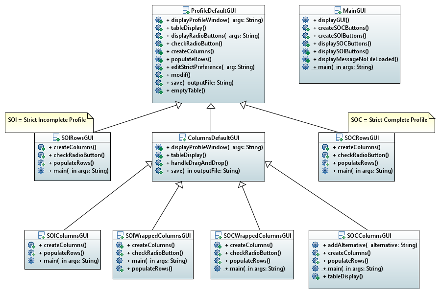
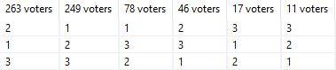
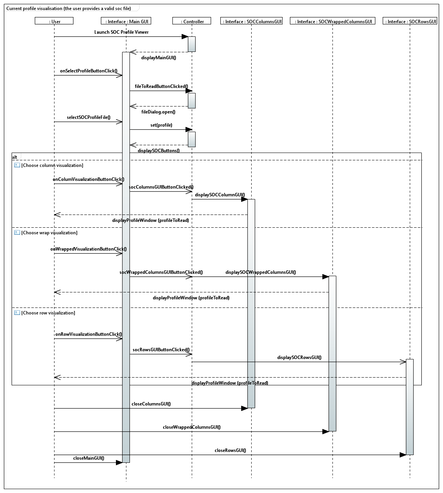

= 2.1 Old GUI understanding 

====== link:../README.adoc[Summary]

=== GUI Class Diagram

=== *MainGUI*

Home GUI allowing to load a profile and then select how to display it.

[cols="1,1,2", options="header"] 
|===
|Method name
|Contract
|Comment

|displayGUI()
|_Not specified_
|This method creates a GridLayout object to arrange the components on a rectangular grid. It also creates a file selection object. It calls the createSOCButtons() and createSOIButtons() methods. It contains an event handler that detects the extension of the selected file and calls displaySOIButtons or displaySOCButtons.

|createSOCButtons()
|Instantiates and set characteristics of SOC buttons with their specific behaviors.
|Creates 3 buttons (Rows, Columns, Wrapped). It contains the associated listeners. It tests if the file selected in displayGUI() exists and calls the displayProfileWindow() method of the corresponding classes (SOCColumnsGUI, SOCRowsGUI or SOCWrappedColumnsGUI) depending on the button pressed. If the file is null or empty, call displayMessageNoFileLoaded() method.

|createSOIButtons()
|Instantiates and set characteristics of SOI buttons with their specific behaviors.
|Same as createSOCButtons() but for SOI file and SOI methods.

|displaySOCButtons()
|Displays SOC buttons and hides SOI ones.
|Explicit contract

|displaySOIButtons()
|Displays SOI buttons and hides SOC ones
|Explicit contract.

|displayMessageNoFileLoaded()
|_Not specified_
|Creates a message box indicating that the selected file could not be loaded.

|main(String[] args)
|_Not specified_
|Call the displayGUI method.
|===

=== *ProfileDefaultGUI*

Generalization of profile displaying GUIs.

[cols="1,1,2", options="header"] 
|===
|Method name
|Contract
|Comment

|displayProfileWindow(String[] args)
|Displays the window : the table containing the profile as well as the buttons.
|This method displays a window, receives a file and tries to create a profile from it. It calls displayRadioButtons() and tableDisplay() methods. 

|tableDisplay()
|Displays the table containing the profile.
|Create an empty array and call the createColumns(), populateRows and checkRadioButton() methods to fill it.

|displayRadioButtons()
|Displays the radio buttons to choose the layout of the profile. This method works for both SOC and SOI.
|Receives a file and recovers its extension . Depending on the extension (SOC or SOI) and the selected button (columns, rows or wrapped), calls the tableDisplay() method of the concerned class (SOIRowsGUI, SOCRowsGUI, SOIColumnsGUI, SOCColumnsGUI, SOIWrappedColumnsGUI or SOCWrappedColumnsGUI).

|checkRadioButton()
|Checks the right radio button.
|Check the radio button "column" and uncheck "row" and "wrapped".  It may be necessary to add to the contract that the display "column" is checked by default.

|createColumns()
|_Not specified_
|Create a StrictProfileI with the voters. For each voters in the profile, the method creates a column in a table.

|populateRows()
|Fills the table of the profile with the alternatives : by default, each column contains the preference of a voter.
|Create a StrictProfileI with the alternatives. It creates a number of table rows equal to the number of alternatives.

|editStrictPreference(String arg)
|Displays the editButton window, where you can choose to modify/add a StrictPreference of a voter.
|Explicit contract + Takes the id of the vote to be changed and its new preference.

|modif()
|Edits the profile with the given information.
|Creates a voter from the id of the voter you wish to modify in editStrictPreference(String arg). It then assigns to the voter the new preference defined in editStrictPreference(String arg)

|save(String outputFile)
|Saves the changes to the file containing the profile.
|Create a file and write to it by calling the writeToSOC(OutputStream) or writeToSOI(OutputStream) methods depending on the file extension.

|emptyTable()
|Empties the table : removes all data and columns. Removes the saveButton button if it isn't disposed yet.
|Explicit contract.
|===

=== *ColumnsDefaultGUI*

[cols="1,1,2", options="header"] 
|===
|Method name
|Contract
|Comment

|displayProfileWindow(String[] args)
|Displays the window : the table containing the profile as well as the buttons
|This method receives a path file and tries to create a profile from it. It creates the 'save' button and calls save() and tableDisplay() methods.

|tableDisplay()
|Displays the table containing the profile
|Creates an empty array and calls the handleDragAndDrop(), createColumns(), populateRows and checkRadioButton() methods to fill it.

|handleDragAndDrop()
|Implements dragging and dropping a cell at a time within the same column. When moving it up, the cell it is dropped on and those below will go down one cell. When moving it down, the cell it is dropped on and those above will go up one cell.
|Uses the addListener() method to be notified when the 'MouseDown' event occurs.

|handleEvent(Event event)
|Sent when an event that the receiver has registered for occurs.
|Handles different movements (if moving from one voter to another, if moving cell within the same column, if source is over destination in the table, if source is underneath destination in the table) and creates messages if needed.

|save(String outputFile)
|Saves the changes to the file containing the profile.
|Checks whether the file extension is SIO or SOC, otherwise sends an error message.
|===

=== *SOIRowsGUI*

[cols="1,1,2", options="header"] 
|===
|Method name
|Contract
|Comment

|createColumns()
|Creates the titled columns of the displayed screen when the row visualisation is chosen
|Creates an ArrayList<String> representing the title of the column. The first one is 'Voters' ans then 'Alternative 1', 'Alternative 2' etc

|checkRadioButton()
|Checks the right radio button.
|The button clicked is the row one

|populateRows()
|Fills the table of the profile with the alternatives : by default, each column contains the preference of a voter
|Trough an ArrayList<String>, creates a row with the different voters ID and their classified alternatives
|===

=== *SOCRowsGUI*

[cols="1,1,2", options="header"] 
|===
|Method name
|Contract
|Comment

|createColumns()
|Creates the titled columns of the displayed screen when the row visualisation is chosen
|Creates an ArrayList representing the title of the column. The first one is 'Voters' ans then 'Alternative 1', 'Alternative 2' etc

|checkRadioButton()
|Checks the right radio button.
|The button clicked is the row one

|populateRows()
|Fills the table of the profile with the alternatives : by default, each column contains the preference of a voter
|Trough an ArrayList<String>, creates a row with the different voters ID and their classified alternatives
|===

=== *SOIColumnsGUI*

[cols="1,1,2", options="header"] 
|===
|Method name
|Contract
|Comment

|
|
|

|
|
|

|
|
|
|===

=== *SOIWrappedColumnsGUI*

[cols="1,1,2", options="header"] 
|===
|Method name
|Contract
|Comment

|
|
|

|
|
|

|
|
|
|===

=== *SOCWrappedColumnsGUI*

[cols="1,1,2", options="header"] 
|===
|Method name
|Contract
|Comment

|
|
|

|
|
|

|
|
|
|===

=== *SOCColumnsGUI*

[cols="1,1,2", options="header"] 
|===
|Method name
|Contract
|Comment

|
|
|

|
|
|

|
|
|
|===

=== Rows definition +
This visualization displays the list of the voters on the first column and for each of them, their associated preference on the same row.

Example :

image:../assets/rowsVisualization.png[rowsVisualization]

_Example based on the current GUI_

In the case above, Voter 2 chose to put the 10th alternative at the first rank, the 1st at the second rank and the 3rd at the last rank. 

=== Columns definition +
This visualization displays the list of the voters on the first row and for each of them, their associated preference on the same column.

Example :

image:../assets/columnsVisualization.png[columnsVisualization]

_Example based on the current GUI_

In the case above, Voter 6 chose to put the 2nd alternative at the first rank, the 5th at the second rank and the 7th at the last rank. 

=== Wrapped definition +
This visualization enables to see how many voters have the same preference ( in other words the same order of alternatives). This number is displayed on the row at the top of the table and below the order we are talking about.

Example :

_Example based on the current GUI_

In the case above, 263 Voters have chosen the same preference. They put the 2nd alternative at the first rank, then the 1st and the 3rd one to finish.

=== Sequence diagram of the current way to visualize a profile (the user provides a correct SOC file)

