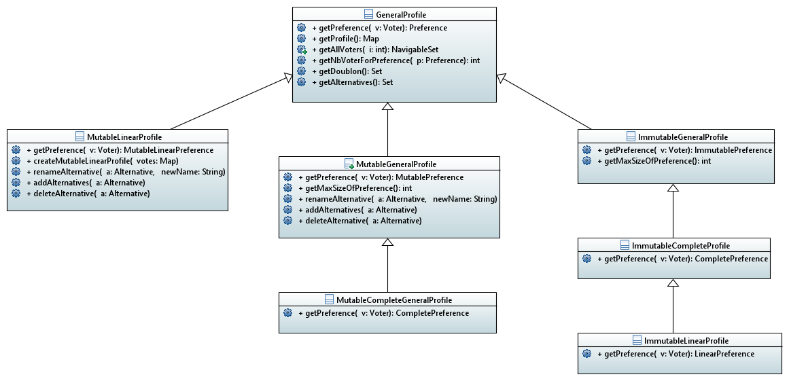

= A better profile architecture 

== Class diagram

== Notion of mutability 

In the theory of social choice, a Profile (groupement of voters with their preference) can be mutable in two different ways : 

- The population is fixed but the preferences aren't.
In other words, preferences are modifiable which means that the  alternatives can be reordered, removed or new ones can be added. Nevertheless the voters always stay the same. 

- The preferences are fixed but the population isn't.
In other words, here we can add new voters, or remove an existing one. However once a preference is made it can not be changed.

We decided to build this new architecture proposition around the first definition. Indeed, we can say that if the population needs to be somehow changed. Then we can create a new profile duplicating the preferences but with other voters. 

== Ok, but why a MutableLinearProfile does not extend a MutableGeneralProfile ? 

Because a MutableLinearProfile manipulates MutableLinearPreferences and a MutableGeneralProfile manipulates MutablePreferences. 

Indeed, a MutableLinearPreferences is not a more precise version of a MutablePreferences. Those two type of prefences have no relation link between them. The contrary would break their contract. 

Here is the reason why, when a preference is mutable it can be openly modified. Whereas if the preference is mutable and linear, each modification must maintain the linearity. 

== We can wonder, why don't we have the same issue regarding the Immutable Profiles ?

An Immutable Linear profile can extend an Immutable Complete profile without breaking its contracts because the Linear Preferences manipulated are  actually a more precise version of Complete Preferences. Indeed, because those two types of preferences are Immutable then we can deduce the Complete preference out of a Linear one. 

== Precision on the Profile Set of Alternatives

Inside a profile the set of alternatives is common to all the voters. It is actually the union of all the alternatives present in every preferences.

