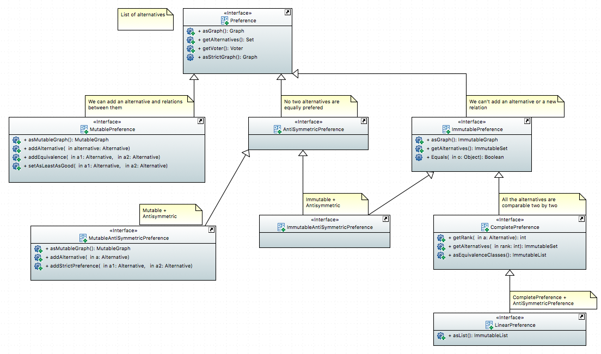

= Preferences Interfaces Documentation

====== After reading the preferences documentation, you can read the profile documentation, which is the second part of the project link:profileInterfaces.adoc[the profil section].

=== Preference definition +
A Preference is the ranking between Alternatives.

=== MutablePreference +
A Preference where you can add Alternatives (only one by one). +
You can also add two relations between Alternatives : 

* The first one is "At least as good".
* The second one is "Equivalence".

=== AntiSymmetricPreference +
A Preference where there is no "Equivalence" relation between Alternatives. +
The only possible relation is "Greater than".

=== ImmutablePreference +
A Preference where we can't add Alternatives or any relations.

=== MutableAntiSymmetricPreference +
// AntiSymmetricPreference + MutablePreference

=== ImmutableAntySymmetricPreference +
// AntiSymmetricPreference + ImmutablePreference

=== CompletePreference +
An ImmutablePreference where all the Alternatives have a two-to-one relation. +
A CompletePreference represents a complete preorder, also called a weak order.

=== LinearPreference +
// CompletePreference + AntiSymmetricPreference

=== Preferences Interfaces Diagram

== Preferences methods analysis +

==== *Preference*

[cols="1,1,2", options="header"] 
|===
|Method name
|Contract
|Relevance

|asGraph()
|
|

|getAlternatives()
|
|

|getVoter()
|
|

|asStrictGraph()
|
|

|===

==== *MutablePreference*

[cols="1,1,2", options="header"] 
|===
|Method name
|Contract
|Relevance

|asMutableGraph()
| Return the Graph corresponding to the Preference. This graph is not necessarily transitive and not necessarily reflexive.
|

|addAlternative(Alternative a)
| Adds an alternative to the Preference. This alternative is not preferred to any other of the preference, it is being added isolated.
|

|addEquivalence(Alternative a1, Alternative a2)
| Adds an edge from an alternative a1 to an alternative a2 and from a2 to a1. a1 and a2 are ex-aequo.
|

|setAsLeastAsGood(Alternative a1, Alternative a2)
| Adds an edge from an alternative a1 to an alternative a2, so that a1 is asleast as good as a2 (a1 >= a2). 
| 

|===

==== *ImmutablePreference*
An Immutable Preference is a preference that cannot be modified

[cols="1,1,2", options="header"] 
|===
|Method name
|Contract
|Relevance

|asGraph()
| return the Graph corresponding to the Preference.
|

|getAlternatives()
| Returns an alternatives's set which is immutable.
|

|equals(Object o)
| 
|

|===

==== *CompletePreference*
A Complete Preference is an immutable preference. It represents a complete pre-order, also called a weak order : for each couple of alternatives (a,b) we can find an order a>=b or b>=a.

[cols="1,1,2", options="header"] 
|===
|Method name
|Contract
|Pertinence

|getRank(Alternative a)
| Returns the rank of this alternative (a number between 1 and n) where n is the total number of Alternative instances.
|

|getAlternatives(int rank)
| Returns the Aternative set at this rank. Empty set id there is no alternative at this rank.
|

|asEquivalenceClasses()
|Returns the same data but in an Immutable list object. A set of alternative is strictly prefered to next sets. All the alternatives in a set are considered ex-aequo.
|

|===

==== *LinearPreference*
A linear preference is an antisymmetric complete preference. A linear preference represents a linear order, or equivalently an antisymmetric complete order, or also equivalently, the reduction of a weak-order.

[cols="1,1,2", options="header"] 
|===
|Method name
|Contract
|Pertinence

|asList()
|Returns a sorted list of alternatives corresponding to the preference.
|

|===