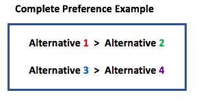
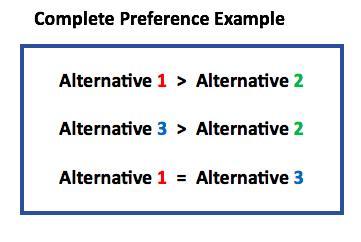

= Preferences Interfaces Documentation

====== After reading the preferences documentation, we invite you to read link:profileInterfaces.adoc[the profil section].

=== Preferences Interfaces Diagram

image:./assets/InterfacesPreferencesDiagram.png[InterfacesPreferencesDiagram]

=== Preference definition +
A Preference is the ranking between Alternatives.

=== MutablePreference +
A Preference where you can add Alternatives (only one by one). +
You can also add two relations between Alternatives : 

* The first one is "At least as good".
* The second one is "Equivalence".

=== AntiSymmetricPreference +
A Preference where there is no "Equivalence" relation between Alternatives. +
The only possible relation is "Greater than".

=== ImmutablePreference +
An Immutable Preference is a preference that cannot be modified. We can't add Alternatives or any relations.

// === MutableAntiSymmetricPreference +
// AntiSymmetricPreference + MutablePreference

// === ImmutableAntySymmetricPreference +
// AntiSymmetricPreference + ImmutablePreference

=== CompletePreference +
An ImmutablePreference where all the Alternatives have a two-to-one relation. +
A CompletePreference represents a complete preorder, also called a weak order: for each couple of alternatives (a,b) we can find an order a>=b or b>=a.
 

=== LinearPreference +
A linear preference is an antisymmetric complete preference. A linear preference represents a linear order, or equivalently an antisymmetric complete order, or also equivalently, the reduction of a weak-order.

image:./assets/LinearPreferenceScheme.PNG[LinearPreferenceScheme]

== Preferences methods analysis +

=== *Preference*

[cols="1,1,2", options="header"] 
|===
|Method name
|Contract
|Relevance

|asGraph()
|In the graph : a relation from <i>a</i> to <i>b</i> means "a is at least as good as b". This graph can't be modified, but is not necessarily immutable.
Reflexive and transitive.
@return the Graph corresponding to the Preference
|To do

|getAlternatives()
|The returned set reads through this object: if this object is mutable, any modification to this object modifies the returned set, and conversely.
@return alternatives's set
|To do

|getVoter()
|@return <code>Voter</code> instance of the preference, Returns the voter 0 if no specific voter is associated to this preference
|To do

|asStrictGraph()
| This method is going to be implemented in the Java iteration, and so its contract.
| /

|===

=== *MutablePreference*

[cols="1,1,2", options="header"] 
|===
|Method name
|Contract
|Relevance

|asMutableGraph()
| Returns the Graph corresponding to the Preference. This graph is not necessarily transitive and not necessarily reflexive.
| OK.

|addAlternative(Alternative a)
| Adds an alternative to the Preference. This alternative is not preferred to any other of the preference, it is being added isolated.
| OK.

|addEquivalence(Alternative a1, Alternative a2)
| Adds an edge from an alternative a1 to an alternative a2 and from a2 to a1. a1 and a2 are ex-aequo.
| The method does not deal with the fact that when an alternative is not in the graph it must be added. 

|setAsLeastAsGood(Alternative a1, Alternative a2)
| Adds an edge from an alternative a1 to an alternative a2, so that a1 is asleast as good as a2 (a1 >= a2). 
| Similarly, the method does not deal with the fact that when an alternative is not in the graph it must be added. 

|===

=== *MutableAntiSymmetricPreference*

[cols="1,1,2", options="header"] 
|===
|Method name
|Contract
|Relevance

|asMutableGraph()
| This graph is not necessarily transitively closed and not necessarily reflexive. This method might refuse that an edge be added that would result in the transitive closure violating anti-symmetry, though it will not necessarily check (but it is guaranteed to check if asGraph() has been called previously). If such a situation happens, and is not detected (thus implying that asGraph() has never been called), an exception will be raised the first time asGraph() will be called, unless possibly the transitive closure no more violates anti-symmetry at that time (behavior is undefined in such a case).
| Not Ok. The exception is not raised.

|addAlternative(Alternative a)
| Adds an alternative to the Preference. This alternative is not preferred to any other of the preference, it is being added isolated.
| Ok.

|addStrictPreference(Alternative a1, Alternative a2)
| Adds an edge from a1 to a2, so that a1 is preferred to a2 (a1 > a2). If one of them is not in the graph, they are added.
Graph is rearranged : a transitive closure is applied to it
@param a1 preferred alternative to a2
@param a2 "lower" alternative
| Ok.

|===

=== *ImmutablePreference*

[cols="1,1,2", options="header"] 
|===
|Method name
|Contract
|Relevance

|asGraph()
| Returns the Graph corresponding to the Preference. This graph is immutable, reflexive and transitive.
| OK.

|getAlternatives()
| Returns an alternatives's set which is immutable.
| OK.

|Equals(Object o)
| This method is going to be implemented in the Java iteration, and so its contract.
| /

|===

=== *CompletePreference*

[cols="1,1,2", options="header"] 
|===
|Method name
|Contract
|Relevance

|getRank(Alternative a)
| Returns the rank of this alternative (a number between 1 and n) where n is the total number of Alternative instances.
| OK.

|getAlternatives(int rank)
| Returns the Aternative set at this rank. Empty set id there is no alternative at this rank.
|OK. However, the method does not handle the case of a rank bigger than the number of sets contained in equivalenceClasses

|asEquivalenceClasses()
|Returns the same data but in an Immutable list object. A set of alternative is strictly prefered to next sets. All the alternatives in a set are considered ex-aequo.
| OK.

|===

=== *LinearPreference*

[cols="1,1,2", options="header"] 
|===
|Method name
|Contract
|Relevance

|asList()
|Returns a sorted list of alternatives corresponding to the preference.
| OK.				                                                     

|===
