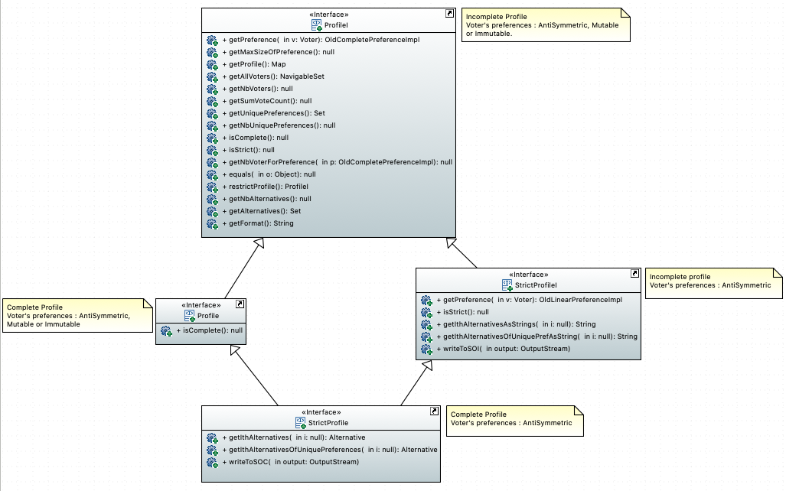

= Profile Interfaces documentation

====== Before jumping into the profiles we strongly advice you to read link:preferenceInterfaces.adoc[the preference section].

== Profile definition +
A profile is a list of all the alternatives ranking made by each indivual in a society. In another words, *it is a list matching a person with its preference*. 

== Complete profile +
A profile is consireded as complete if all the voters produced their preferences according to *the same set of alternatives*. 

== Incomplete profile +
An Incomplete profile would mean that *the alternatives included in each voter's preference can be different*. +
For example, some of the voters didn't know about the existence of some alternative or they included, in their choice, an external alternative not part of the main set. 

== Strict profile + 
In each individual preferences, they can not be alternatives that are equally ranked. In other words, all the preferences linked to each voters are considered as Anti Symmetric.

=== Profile interfaces Diagram

== Profile methods analysis +

==== *ProfileI*

[cols="1,1,2", options="header"] 
|===
|Method name
|Contract
|Relevance

|getPreference(Voter v)
| Return the OldCompletePreferenceImpl of a provided Voter. The Voter doesn't be null. Throw a new NoSuchElementException if the Voter isn't in the map. 
| Ok.

(A voir) Pour moi cette methode son contrat dans ProfileI c'est : je lui donne un voteur et elle me renvoie sa préférence si elle existe.  Or non elle me renvoie pas la préférence du voter mais une OldCompletePreferenceImpl du voter.

|getMaxSizeOfPreference()
| Return the maximum size of a Preference in an incomplete Profile.
| OK.

|getProfile()
| Return the profile as a map mapping the voters to their preference.
| OK.

|getAllVoters(int i)
| Return a sorted set of all the voters in the profile. The voters are ordered by id.
| The use of the TreeSet collection is not specified in the contract. It is however it which makes it possible to order the Voters.

(A voir) Jsp si treeset doit etre mentionné dans le contrat. Par contre on peut critiquer l'utilisation de NavigableSet. Definition : "NavigableSet behaves like a SortedSet with the exception that we have navigation methods available in addition to the sorting mechanisms of the SortedSet. For example, NavigableSet interface can navigate the set in reverse order compared to the order defined in SortedSet." -> C'est bien beau mais c'est jamais utilisé dans la méthode

|getNbVoters()
| Return the number of voters in the profile. Call the getAllVoters method.
| OK

|getSumVoteCount()
| Return the sum of the counted votes. 
| This method counts the number of voters to determine the number of votes. The code is a copy of the getNbVoters method. Is this method really necessary?

|getUniquePreferences()
| Return a set of all the different preferences in the profile.
| The notion of uniqueness doesn't appear. There is no test to verify that the preference is indeed unique. For us, the code rebuilds an already existing list.

|getNbUniquePreferences()
| Return the number of different preferences in the profile. 
| Ok. 

Peut etre rajouter : if we assume that getUniquePreferences is OK. (jsp ça faut voir)

|isComplete()
| Return true if the profile is complete (all the preferences are about the same alternatives exactly).
| Ok.

|getNbVoterForPreference(OldCompletePreferenceImpl p)
| Return the number of voters that voted for a provided OldCompletePreferenceImpl not null.
| Ok.

|isStrict()
| Return true if the profile is strict (the preferences don't have several alternatives that have the same rank).
| Ok.

|equals(Object o)
| Return true if both objects implement ProfileI, contain all the same voters and each voter has the same preference in the callingprofile and in the profile given as parameter.
| Ok.

|restrictProfile()
| Return the stricter profile possible.
| For us the code doesn't match with the contract. This method should return a profile who has as many preferences as possible that are antysimetric. For us, a restriction (the name of the method) is modifing an existing thing to match with new constraints. We don't see the notion of modification in the code but only the notion of creation.

|getNbAlternatives
| Return the number of alternatives in the profile.
| Ok.

|getAlternatives
| Return a set of all the alternatives in the profile.
| Ok.

|getFormat
| Return the format of the Profile when restricted.
| Ok. It might be a good idea to modify the returns because "toi", "soi", "toc", "soc" are not very clear terms.

|===

==== *StrictProfileI*

[cols="1,1,2", options="header"] 
|===
|Method name
|Contract
|Relevance

|getPreference(Voter v) 

[red]#c'est override de ProfileI jsp si faut le dire ou pas#
| Return the AntiSymmetric preference of a provided voter.
|The current contract doesn't mention the fact that the returned preference is not solely AntiSymmetric but Complete as well.

|isStrict() 

[red]#c'est override de ProfileI jsp si faut le dire ou pas#
| Return that the profile is strict.
|Ok. 

|getIthAlternativesAsStrings(int i)
| Return a list of all the alternatives (as string) at a certain position in all the voters preferences. (example : the third alternative of every voters preference). +
An empty string in the list means that the voter doesn't have an alternative at this position in his preference.
| Ok. 

|getIthAlternativesOfUniquePrefAsString(int i)
| Return a list of all the alternatives (as string) at a certain position in all the unique preferences. An empty string in the list means that the voter doesn't have an alternative at this position in his unique preference.
| Ok. If we assume that the preferences used to process the list are really unique.

|writeToSOI(OutputStream output)

A continuer

| Write the SOI document in the given output parameter. 
Throws IOException if it fails to do so.
| Ok. The name "destination" would better for the parameter.

|===

