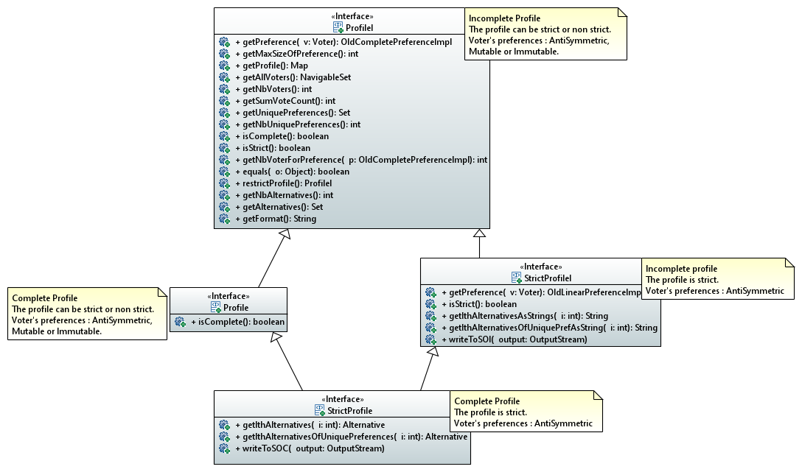
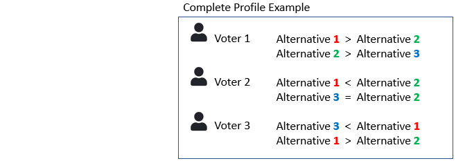
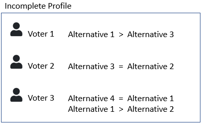
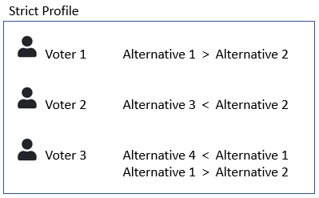

= Profile Interfaces documentation

====== Before jumping into the profiles we strongly advice you to read link:preferenceInterfaces.adoc[the preference section].

=== Profile interfaces Diagram

== Profile definition +
A profile is a list of all the alternatives ranking made by each indivual in a society. In another words, *it is a list matching a person with its preference*. 

== Complete profile +
A profile is consireded as complete if all the voters produced their preferences according to *the same set of alternatives*. 

== Incomplete profile +
An Incomplete profile would mean that *the alternatives included in each voter's preference can be different*. +
For example, some of the voters didn't know about the existence of some alternative or they included, in their choice, an external alternative not part of the main set. 

== Strict profile + 
In each individual preferences, they can not be alternatives that are equally ranked. In other words, all the preferences linked to each voters are considered as Anti Symmetric.

== Profile methods analysis +

==== *ProfileI*

[cols="1,1,2", options="header"] 
|===
|Method name
|Contract
|Relevance

|getPreference(Voter v)
| Return the preference of a given Voter v not null. 
| For us, the code betrays the contract because it doesn't return a preference but an OldCompletePreferenceImpl (which is more precise than a preference).

|getMaxSizeOfPreference()
| Return the maximum size of a Preference in an incomplete Profile.
| Ok.

|getProfile()
| Return the profile as a map mapping the voters to their preference.
| Ok.

|getAllVoters(int i)
| Return a sorted set of all the voters in the profile. The voters are ordered by id.
| Ok.

|getNbVoters()
| Return the number of voters in the profile. Call the getAllVoters method.
| Ok.

|getSumVoteCount()
| Return the sum of the counted votes. 
| This method counts the number of voters to determine the number of votes. The code is a copy of the getNbVoters method. Is this method really necessary ?

|getUniquePreferences()
| Return a set of all the different preferences in the profile.
| The notion of uniqueness doesn't appear. There is no test to verify that the preference is indeed unique. For us, the code rebuilds an already existing list.

|getNbUniquePreferences()
| Return the number of different preferences in the profile. 
| Ok. 

|isComplete()
| Return true if the profile is complete (all the preferences are about the same alternatives exactly).
| Ok.

|getNbVoterForPreference(OldCompletePreferenceImpl p)
| Return the number of voters that voted for a provided OldCompletePreferenceImpl not null.
| Ok.

|isStrict()
| Return true if the profile is strict (the preferences don't have several alternatives that have the same rank).
| Ok.

|equals(Object o)
| Return true if both objects implement ProfileI, contain all the same voters and each voter has the same preference in the callingprofile and in the profile given as parameter.
| Ok.

|restrictProfile()
| Return the stricter profile possible.
| For us the code doesn't match with the contract. This method should return a profile who has as many preferences as possible that are antysimetric. For us, a restriction (the name of the method) is modifing an existing thing to match with new constraints. We don't see the notion of modification in the code but only the notion of creation.

|getNbAlternatives
| Return the number of alternatives in the profile.
| Ok.

|getAlternatives
| Return a set of all the alternatives in the profile.
| Ok.

|getFormat
| Return the format of the Profile when restricted.
| It might be a good idea to modify the returns because "toi", "soi", "toc", "soc" are not very clear terms.
|===

==== *Profile*

[cols="1,1,2", options="header"] 
|===
|Method name
|Contract
|Relevance

|isComplete()
| Return that the profile is complete.
| Ok.
|===

==== *StrictProfileI*

[cols="1,1,2", options="header"] 
|===
|Method name
|Contract
|Relevance

|getPreference(Voter v) 

| Return the AntiSymmetric preference of a provided voter.
|Again the contract is not clear. It says return an AntiSymmetric preference but the return type is OldLinearPreferenceImpl which is more precise than just AntiSymmetric.

|isStrict() 
| Return that the profile is strict.
|Ok. 

|getIthAlternativesAsStrings(int i)
| Return a list of all the alternatives (as string) at a certain position in all the voters preferences. (example : the third alternative of every voters preference). +
An empty string in the list means that the voter doesn't have an alternative at this position in his preference.
| Ok. 

|getIthAlternativesOfUniquePrefAsString(int i)
| Return a list of all the alternatives (as string) at a certain position in all the unique preferences. An empty string in the list means that the voter doesn't have an alternative at this position in his unique preference.
| Ok. 

|writeToSOI(OutputStream output)
| Contract not defined.
| The contract is not specified and needs to be defined. 
We assume that the aim of the method is to compute a profile report in the SOI format (again SOI term not defined) at a given destination. +
Thus the name "destination" would be more approriate for the parameter.
|===

==== *StrictProfile*

[cols="1,1,2", options="header"] 
|===
|Method name
|Contract
|Relevance

|getIthAlternatives(int i);
| Return a list of all the alternatives at a certain position in all the voters preferences. 
| Why would StrictProfileI declare the same function having just the returned alternatives type changed as string. +
Factorisation might be possible.

|getIthAlternativesOfUniquePreferences(int i);
| Return a list of all the alternatives at a certain position in all the voters unique preferences. 
| Again StrictProfileI has a very similar method with only the return type changed. +
Factorisation might be possible.

| writeToSOC(OutputStream output);
| Writes the strict and complete profile into a new file with the SOC format.
| SOC format needs to be defined in order to be sure that the computed report is indeed in this format. +
Again, for us, the name "destination" would be more approriate for the parameter.

|===

